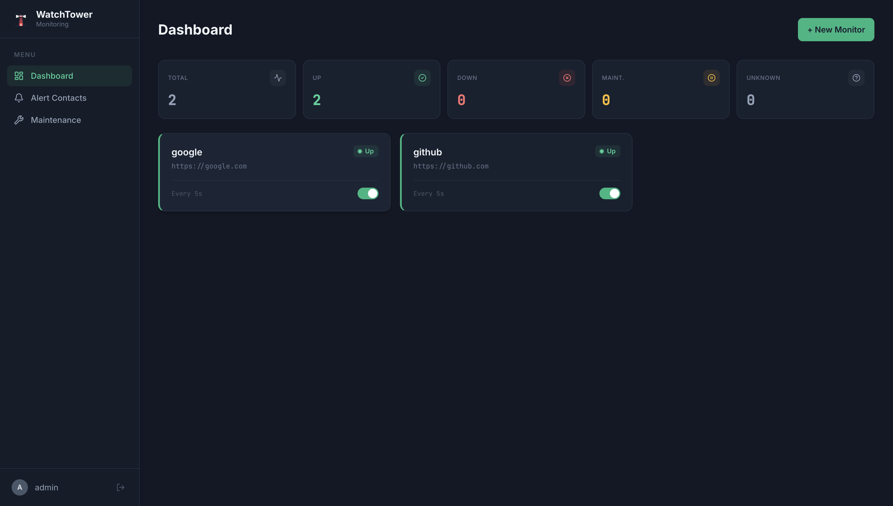
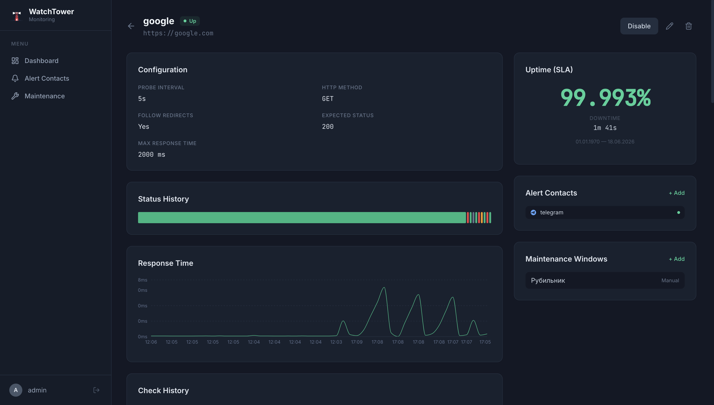

# WatchTower

[](https://golang.org/)
[](LICENSE)

**WatchTower** is a self-hosted web resource monitoring system.
---

## 📢 Screenshots

### Dashboard



### Monitor Details

---

## ✨ Key Features

- **Target Deduplication:** Automatically merges identical targets across different users to reduce network and storage overhead.
- **Multi-user Support:** Built from the ground up for teams. Each user has their own monitors, notification channels, and maintenance windows.
- **Flexible Notifications:** Easily route alerts to Telegram, Email, and more.
- **Maintenance Windows:** Temporarily mute alerts and pause SLA calculations during planned downtimes.

---

## 😀 Getting Started

The easiest way to run both the Web UI and the Backend API is using our unified Dockerfile.

### Prerequisites
- [Docker](https://docs.docker.com/get-docker/)

### Quick Start (Docker)

1. Clone the repository:
   ```bash
   git clone https://github.com/yourusername/WatchTower.git
   cd WatchTower
   ```

2. Build and run the image:
   ```bash
   docker build -t watchtower .
   docker run -d -p 80:80 -p 8080:8080 --volume $(pwd)/configs:/etc/watchtower/configs --name watchtower watchtower
   ```

---
