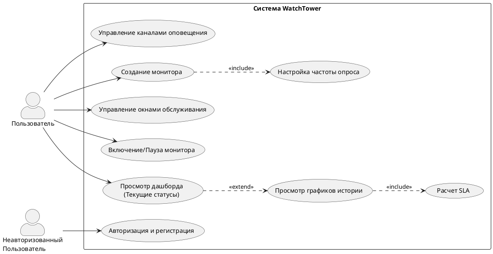
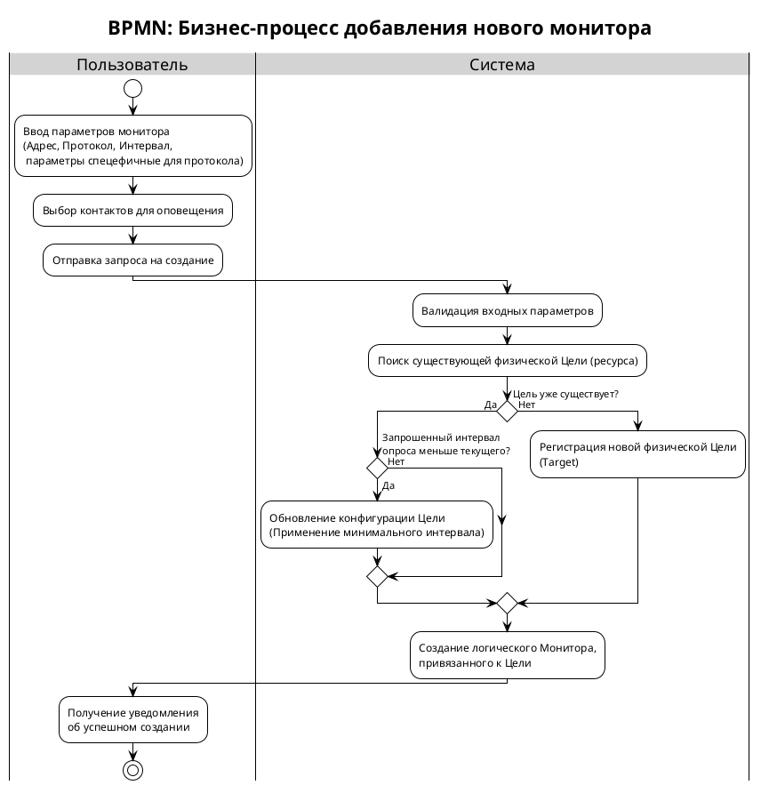
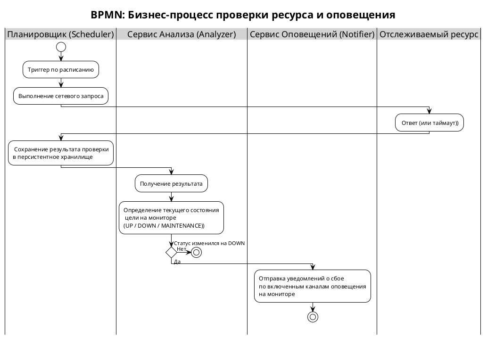

# WatchTower

## 1. Идея проекта
WatchTower — это self-hosted система для многопользовательского мониторинга доступности веб-ресурсов. Проект реализует архитектуру с дедупликацией целей мониторинга, что позволяет множеству пользователей отслеживать одни и те же ресурсы без кратного увеличения сетевой нагрузки и объема хранимых данных.

## 2. Описание предметной области
Предметная область охватывает автоматизацию контроля состояния распределенных информационных систем и сетевой инфраструктуры. Основной акцент делается на разделении физического опроса ресурсов и логического представления результатов для пользователей.

Ключевыми сущностями предметной области являются: **Users** (владельцы конфигураций), **Targets** (физические ресурсы: URL или IP, подлежащие проверке), **UserMonitors** (персонализированные настройки мониторинга), **CheckResults** (хронологические записи телеметрии), **MaintenanceWindows** (интервалы планового обслуживания, исключаемые из оповещений подсчета sla).

## 3. Анализ аналогичных решений

| Критерий сравнения                                    | UptimeRobot (SaaS)                           | Uptime Kuma (Open Source)                | Gatus (Open Source)                           | **WatchTower (Разрабатываемое)**                              |
|:------------------------------------------------------|:---------------------------------------------|:-----------------------------------------|:----------------------------------------------|:--------------------------------------------------------------|
| **Приватность данных**                                | Низкая (Данные хранятся в облаке провайдера) | Высокая (Self-hosted)                    | Высокая (Self-hosted)                         | **Высокая (Self-hosted)**                                     |
| **Архитектура и производительность**                  | Закрытый код                                 | Node.js (Однопоточная модель, SQLite)    | Go (Высокая производительность, YAML конфиги) | **Go (Высокая производительность, PostgreSQL + Redis)**       |
| **Оптимизация опроса (Дедупликация)**                 | Нет данных (SaaS)                            | Нет (Каждый монитор — отдельный процесс) | Нет (Config-as-Code)                          | **Да (Объединение одинаковых целей от разных пользователей)** |
| **Возможность мониторинга ресурсов в локальной сети** | Нет (Saas)                                   | Да                                       | Да                                            | **Да**                                                        |
| **Многопользовательский режим**                       | Есть (Платный тариф)                         | Есть                                     | Отсутствует                                   | **Есть**                                                      |

## 4. Обоснование целесообразности и актуальности
Разработка WatchTower обусловлена потребностью в инструменте, который сочетает простоту использования SaaS-решений с безопасностью и контролем self-hosted систем, при этом превосходя существующие Open Source аналоги в производительности.

## 5. Краткое описание акторов (ролей)
*   **Пользователь (User):** Основной потребитель системы. Создает и настраивает мониторы (`UserMonitors`), задает периоды обслуживания (`SuspendIntervals`), просматривает дашборды и получает уведомления об инцидентах.
*   **Неавторизованный пользователь (Admin):** Ничего не может. Только авторизоваться.

## 6. Use-case диаграмма


## 7. ER-диаграмма
```plantuml
@startchen
!theme plain
left to right direction

entity Пользователь {
    Логин <<key>>
    Хеш пароля
}

entity Монитор {
    ID <<key>>
    Название
    Статус
    Expectations
    Интервал опроса
    Включен ли
}

entity Цель {
    ID <<key>>
    endpoint
    протокол или тип
    конфигурация
}

entity Результат_опроса {
    ID <<key>>
    Ошибка сети флаг
    Status code
    Время задержки latency
    Метаинформация
    Время создания
}

entity Check_Summary {
    ID <<key>>
    Статус
}

entity История_Изменений_Монитора {
    Статус
    Время начала
    Время конца
}

entity Канал_Оповещения {
    ID <<key>>
    Тип
    Конфигурация
}

entity Окно_Обслуживания {
    ID <<key>>
    Название
    Описание
    Тип
    Конфигурация
}

relationship "Владеет" as owns1 {
}

relationship "Владеет" as owns2 {
}

relationship "Ссылается" as refs1 {
}

relationship "Ссылается" as refs2 {
}

relationship "Ссылается" as refs3 {
}

relationship "Ссылается" as refs4 {
}

relationship "Ссылается" as refs5 {
}

relationship "Ссылается" as refs6 {
}

relationship "Оповещает через" as alerts {
}

Пользователь =1= owns1
owns1 =N= Монитор

Пользователь =1= owns2
owns2 =N= Канал_Оповещения

Монитор =N= refs1
refs1 =1= Цель

Результат_опроса =n= refs2
refs2 =1= Цель

Монитор =N= alerts
alerts =N= Канал_Оповещения

История_Изменений_Монитора =N= refs3
refs3 =1= Монитор

Окно_Обслуживания =N= refs4
refs4 =N= Монитор

Check_Summary =1= refs5
Результат_опроса =1= refs5

Check_Summary =N= refs6
Монитор =1= refs6

@endchen
```

## 8. Краткое описание сценариев использования

### Сценарий 1. Добавление монитора для популярного ресурса
> Этот сценарий демонстрирует ключевую архитектурную особенность системы — **дедупликацию целей**.

1.  **Пользователь** инициирует создание нового Монитора, указывая адрес ресурса (URL), желаемую частоту проверок (например, раз в 30 секунд) и конфигурацию.
2.  **Пользователь** выбирает каналы для получения уведомлений (Telegram, Email).
3.  **Система** проверяет, находится ли указанный URL уже под наблюдением (существует ли активная Цель).
4.  **Система** обнаруживает существующую Цель, которая в данный момент опрашивается реже (например, раз в 60 секунд).
5.  **Система** обновляет конфигурацию Цели: устанавливает новую, более высокую частоту опроса (30 секунд), чтобы удовлетворить требования всех подписчиков.
6.  **Система** создает новую подписку (Пользовательский Монитор), связывая Пользователя с данной Целью.
7.  **Система** подтверждает успешное создание монитора.

---

### Сценарий 2. Настройка планового окна обслуживания
1. **Пользователь** инициирует создание нового окна обслуживания.
2. **Пользователь** выбирает тип окна, вводит название и описание, выбирает мониторы, к которым применяется окно.
3. **Система** создает новое окно обслуживания для заданных мониторов.
4. **Система** подтверждает успешное создание окна.

---

### Сценарий 3. Обнаружение сбоя и маршрутизация уведомлений
*   **Предусловия:**
    *   Получено событие об изменении статуса на "DOWN" для ресурса `api.myservice.com`.
    *   На ресурс подписаны два пользователя:
        *   Пользователь A (Окно обслуживания сейчас активно).
        *   Пользователь B (Окон обслуживания нет, мониторинг активен).
        
1.  **Сервис Оповещений** получает сигнал об инциденте.
2.  **Сервис Оповещений** определяет список всех мониторов, связанных с этим ресурсом.
3.  **Сервис Оповещений** начинает итерацию по мониторам для применения фильтров:
4.  *Обработка монитора пользователя A:
    *   Статус монитора определяется, как "MAINTAINING"
    *   **Действие:** Уведомление блокируется (Skipped).
5.  *Обработка монитора пользователя B:*
    *   Статус монитора определяется, как "DOWN"
    *   **Действие:** отправка оповещения в каналы связи связанные с монитором пользователя B.

## 9 Формализация ключевых бизнес-процессов
### Процесс добавления монитора с дедупликацией целей


### Процесс опроса ресурса и обработки результатов

